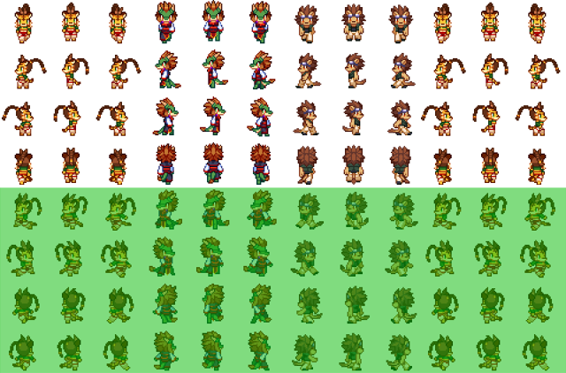
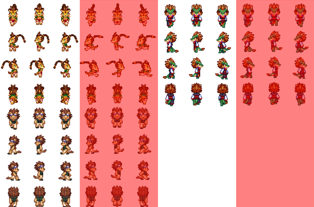
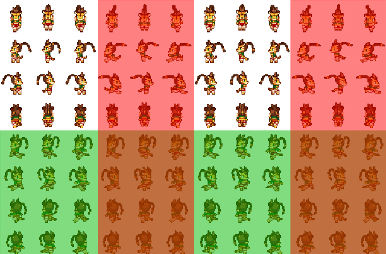
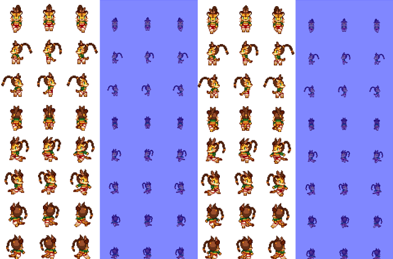
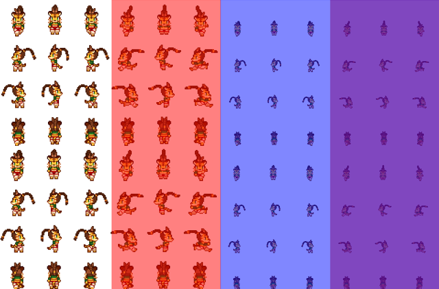
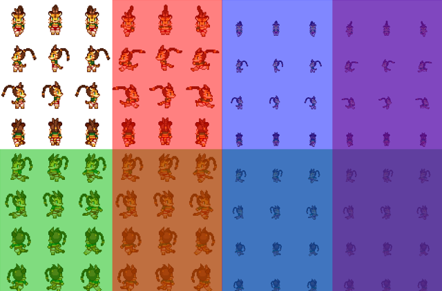

# PD_8DirDash&PD_AdjustCharaSpriteパターン配置解説

## まずはじめに
PD_8DirDash 及び PD_AdjustCharaSprite では
ファイル名の一番後ろのアンダーバーより後ろに特定の文字が含まれるかどうかで画像変更を行うかを決定しています。

### 例 : 斜め移動とダッシュ時の専用画像が存在
- `Char01_QD.png` - 斜め移動とダッシュ時の専用グラフィックが存在

### 例 : 斜め移動の専用画像が存在("D"は判定に含まれない)
特定文字が含まれていても最後のアンダーバーより手前の場合は判定されません。
- `Char01_D_Q.png` - 斜め移動の専用画像のみが存在

### 例 : ダッシュ時の専用画像が存在と誤判定される
ファイル名によっては意図せず専用画像判定に引っかかってしまう可能性があります。
判定文字はすべて大文字なので、なるべく判定部分以外で大文字アルファベットを使用しないようにしてください。
- `Char01_Danger.png` - 誤判定される
- `char01_danger.png` - 誤判定されない

# 8方向移動(PD_8DirDash)
ファイル名の末尾に"Q"が含まれる場合、歩行画像セットの下半分が歩行画像の上半分の斜め移動画像として扱われます。

(画像の緑の部分)

斜め画像の配置はWOLFRPGエディターと同様となっています。
テンキー表示で番号が若い順で覚えると、分かりやすいかもしれません。
1ファイルに配置できるキャラクターは4体になります。

なお、ツクールの使用上エディタ上から下半分をイベントや主人公等の歩行画像として設定可能です。
しかし、表示がおかしくなる可能性が高いため、非推奨となっております。
これに関しては以降すべての特殊歩行画像に関して共通です。

# ダッシュ移動(PD_8DirDash)
ファイル名の末尾に"D"が含まれる場合、右隣の歩行画像がダッシュ時の画像として扱われます。

## 画像の赤い部分

1ファイルに配置できるキャラクターは4体になります。

斜め移動と併用した場合はこのようになります。

## 画像の緑の部分が斜め移動画像、赤い部分がダッシュ用画像、重なっている部分は斜めダッシュ画像

1ファイルに配置できるキャラクターは2体になります。

# フィールド用画像(PD_AdjustCharaSprite)
ファイル名の末尾に"F"が含まれる場合、右隣の歩行画像がフィールド画面での画像として扱われます。

# 画像の青い部分

1ファイルに配置できるキャラクターは4体になります。

ただし、"D"と同時に使用する場合は2列目がダッシュ画像、3列目がフィールド画像になります。
また、4列目はフィールド上でダッシュした際の画像になります。

# 全ての画像変更を併用する場合
| 通常 | ダッシュ | フィールド上 | フィールド上でダッシュ | 
|---|---|---|---|
| 斜め | 斜めダッシュ | フィールド上斜め移動 | フィールド上斜めダッシュ |

1ファイルに配置できるキャラクターは1体になります。
