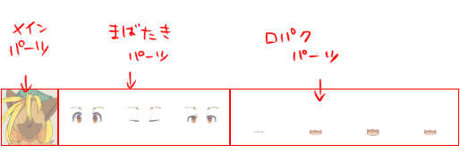
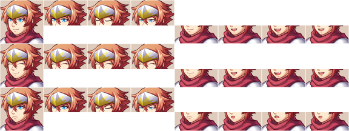
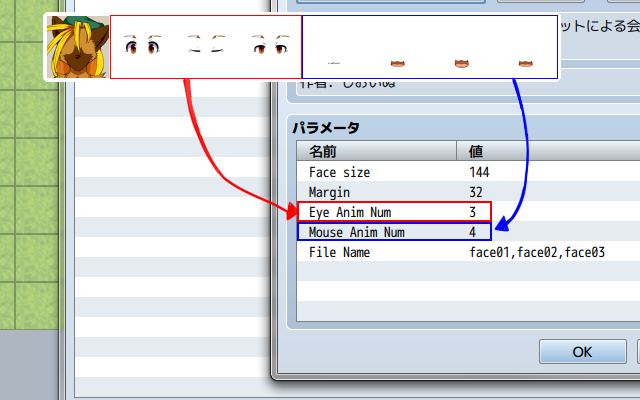
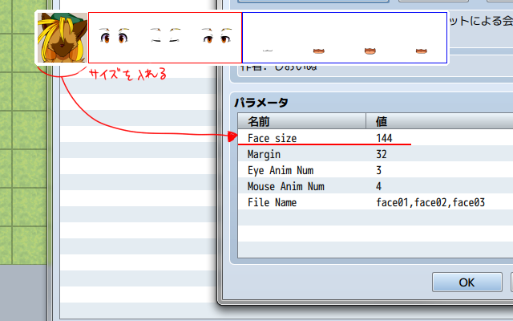

# フェイスチャットシステム使い方解説
## 対応ファイル作成 準備編

フェイスチャット用画像は以下の要素で構成されます。

### メインパーツ
顔の土台となるパーツです。
表情ごとに1つ設定可能です。

### まばたきパーツ
顔の目の部分のみのパーツです。
普段は1枚目のみが表示されますが、システム上でランダムにまばたきを行います。
任意の枚数を設定可能です。

### 口パクパーツ
しゃべる際の口の動きのパーツです。
普段は1枚目のみが表示されますが、喋っている状態に設定されたキャラクターのみアニメーションが行われます。
任意の枚数を設定可能です。

## 注意点

顔画像を制作する際は以下の点に気をつけてください。

### 縦横のサイズを合わせる
今のところ正方形サイズにのみ対応しています。
縦長、横長の顔画像を使用する場合は余白をとって正方形になるようにしてください。

### まばたき、口パク画像はメイン画像と位置を合わせる
位置を合わせないと表示がズレてしまいます。

ちなみに眼と口のパーツが重ならなければこのくらいアバウトな切り抜きでもきちんと表示されます。 
と言うかこっちのほうが楽です。

これを表情ごとに縦に並べてフェイスチャット用顔画像の完成です。

顔画像を制作したら、プラグインに情報を登録します。
瞬きは"EyeAnimNum"、口パクは"MouseAnimNum"に入力してください。

また、顔画像のピクセル数を"Facesize"に入力してください。

"FileName"にはファイル名を登録します。
必ず","(半角カンマ)で区切り、スペース等は挿入しないでください。

以上で準備は完了です。
